# EF — Reporte de Proyecto
**Estudiante:** [Sejas Colque Fernando Andres]
**Proyecto:** [Citas Psicológicas]
**Repositorio:** [[URL del repositorio](https://github.com/FerSV4/Taller-ConsultorioPsicologia)]
**Fecha de entrega:** [12/06/2026]

---

## Sección 1 — Deploy

**URL del proyecto:** [[URL pública](https://psicosystem.netlify.app)]
**Swagger / API:** [No, Supabase]

> Captura del proyecto corriendo con datos reales:

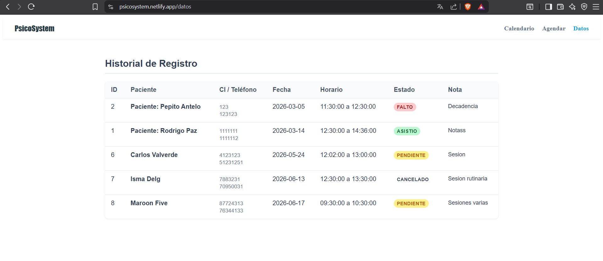

---

## Sección 2 — Pruebas con TDD + cobertura

### Cobertura inicial (0%)

**Herramienta:** [ng test --coverage]

> Captura del reporte de cobertura antes de escribir pruebas nuevas:

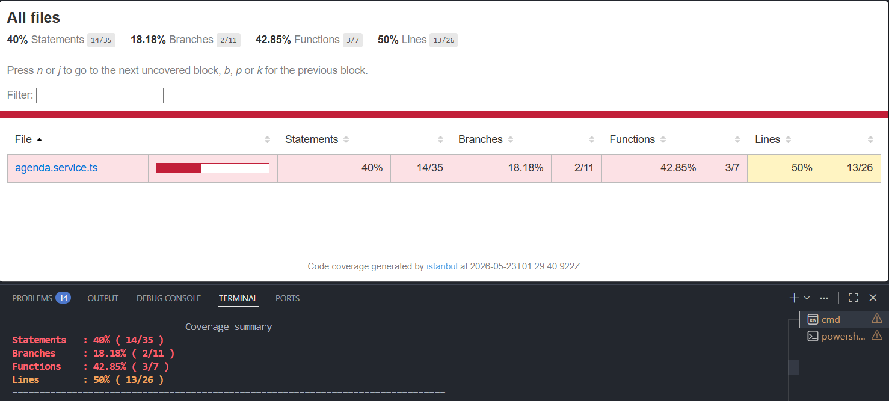

---

### Ciclo TDD — Prueba 1

**HU:** [HU-03] [Reprogramación y eliminación de citas]
> Como recepcionista quiero modificar los datos de una cita existente, y el sistema debe validar las fechas para que no se superponga con otra ya definida.

**CA elegido:** [El sistema valida que el nuevo rango horario no se superponga con otras citas (excluyendose a si misma...)]

**Commit 1 — Rojo** [`227c026`](https://github.com/FerSV4/Taller-ConsultorioPsicologia/commit/227c0260cae584c7012ef64cc452c1dc050efafd):
```
test: [HU-03] agregar prueba para evitar una reprogramacion duplicada
```
Test escrito (sin el código que lo pase aún):
```csharp / typescript
it('rechazar reprogramacion si choca con otra cita', async () => {
    // Arr: Simulo una cita existente a nombre de yan pol
    mockRespuesta = { data: { nombre: 'Yan', apellido: 'Pol' }, error: null };

    const citaEditada = {
      fecha: '2026-11-15', hora_inicio: '09:00', hora_fin: '10:00'
    };

    // Ac--As: Se hace el intento de actualizacion, ser fallido
    const res = await service.actualizarCita(5, citaEditada);
    
    expect(res).toBe('Horario ocupado por Yan Pol');
  });
```

> Captura del test fallando o error de compilación:

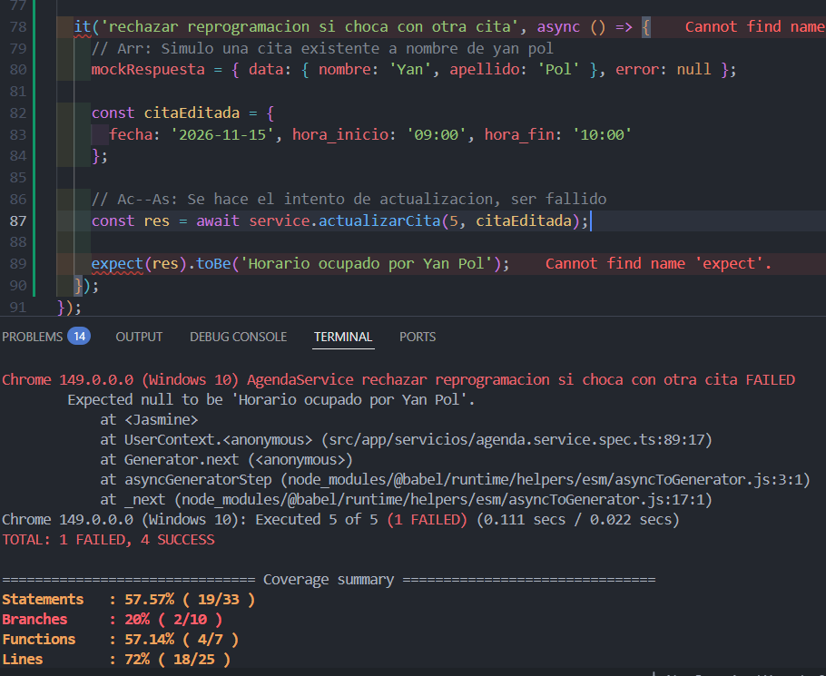

---

**Commit 2 — Verde** [`d68c081`](https://github.com/FerSV4/Taller-ConsultorioPsicologia/commit/d68c081100e704067f28fd72e42a2104f040af8c):
```
feat: [HU-03] habilita validacion de la reprogramacion al edit cita

```
Código mínimo para hacer pasar el test:
```csharp / typescript
  async registrarCita(nuevaCita: Cita): Promise<string | null> {
    const { data: conflicto, error: errorBusqueda } = await this.supabase
      .from('citas')
      .select('nombre, apellido, hora_inicio, hora_fin')
      .eq('fecha', nuevaCita.fecha)
      .lt('hora_inicio', nuevaCita.hora_fin)
      .gt('hora_fin', nuevaCita.hora_inicio)
      .limit(1)
      .maybeSingle();

    if (errorBusqueda) return 'Error en el servidor';
    if (conflicto) return `Horario ocupado por ${conflicto.nombre} ${conflicto.apellido}`;
```

> Captura del test pasando:

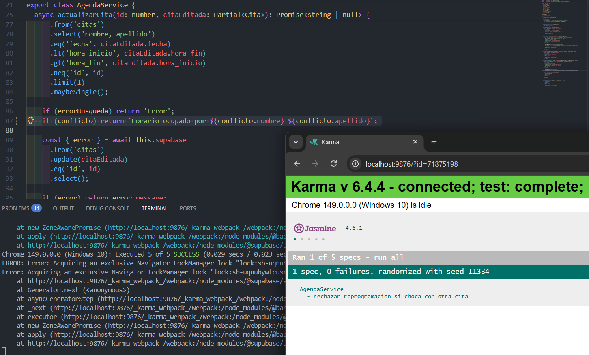

---

**Commit 3 — Refactor** [`cb69d6e`](https://github.com/FerSV4/Taller-ConsultorioPsicologia/commit/cb69d6eebe209395020bcf5fbc1e2f2409d01419):
```
refactor: [HU-03] optimizar carga de la request, quitando el select innecesario para la funcion actualizar}
```
Cambios aplicados:
```csharp / typescript

    if (errorBusqueda) return 'Error';
    if (conflicto) return `Horario ocupado por ${conflicto.nombre} ${conflicto.apellido}`;

    //refactor: se elimina el select porque trae datos innecesarios para el update
    const { error } = await this.supabase
      .from('citas')
      .update(citaEditada)
      .eq('id', id)

```

> Captura del test aún pasando después del refactor:

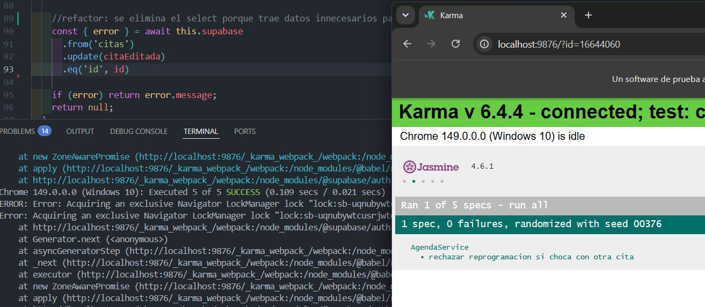

---

### Ciclo TDD — Prueba 2

**HU:** [HU-04] [Control de asistencia]
> Como especialista(psicologo) quiero marcar el estado de asistencia de una cita, pero el sistema debe bloquearlo ya que la cita fue cancelada.

**CA elegido:** [El sistema no debe permitir cambiar el estado de la cita cuando si el estado actual es 'cancelado'.]

**Commit 1 — Rojo** [`168bc90`](https://github.com/FerSV4/Taller-ConsultorioPsicologia/commit/168bc902a7bdfa440e75262938ff926820b32187):
```
test: [HU-04] agregar prueba que evita cambio de estado en citas canceladas.
```
Test escrito (sin el código que lo pase aún):
```csharp / typescript
it('impedir cambio de estado cuando la cita ya fue cancelada', async () => {
    // Arrg: Se crea una cita cancelada como simulacion para esta prueba...
    mockRespuesta = { data: { estado: 'Cancelado' }, error: null };

    // Ac--As: Aqui se intenta marcarla como asistida, tiene q dar error...
    const res = await service.actualizarEstadoCita(10, 'Asistió');
    
    expect(res).toBe('No se puede modificar una cita cancelada');
  });
```

> Captura del test fallando o error de compilación:

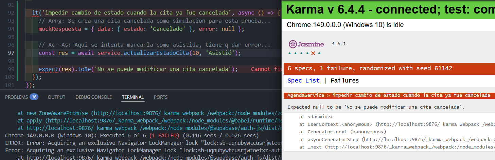

---

**Commit 2 — Verde** [`86bf1f9`](https://github.com/FerSV4/Taller-ConsultorioPsicologia/commit/86bf1f9c490ecb244c2a38b7ca18704aeca778b1):
```
feat: [HU-04] implementar validacion del estado de la cita anterior
```
Código mínimo para hacer pasar el test:
```csharp / typescript
async actualizarEstadoCita(id: number, nuevoEstado: string): Promise<string | null> {
    const { data: citaActual } = await this.supabase
      .from('citas')
      .select('estado')
      .eq('id', id)
      .maybeSingle();

    if (citaActual?.estado === 'Cancelado') {
      return 'No se puede modificar una cita cancelada';
    }

```

> Captura del test pasando:

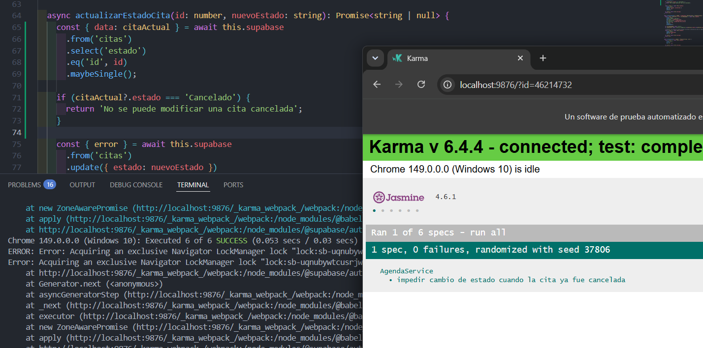

---

**Commit 3 — Refactor** [`2d94134`](https://github.com/FerSV4/Taller-ConsultorioPsicologia/commit/2d9413481a4030a0f3fde252a48b10c28fcba511):
```
refactor: [HU-04] se optimiza la funcion, mejora para traida de datos
```
Cambios aplicados:
```csharp / typescript
    //Para el refactor se quita el .select y evitar traer toda la tabla innecesariamente...
    const { error } = await this.supabase
      .from('citas')
      .update({ estado: nuevoEstado })
      .eq('id', id)
```

> Captura del test aún pasando después del refactor:

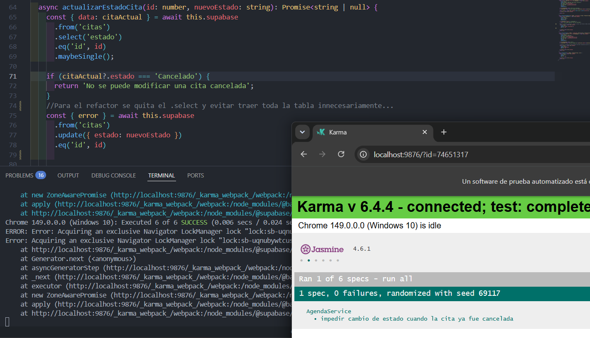


---

### Ciclo TDD — Prueba 3

**HU:** [HU-07] [Bloqueo de horarios]
> Como especialista(psicologo) quiero marcar horarios especifico como bloqueados para evitar que se programen citas en esos tiempos.

**CA elegido:** [Al intentar agendar una cita en un horario que esta marcado como bloqueado, el sistema debe mostrar un mensaje de horario bloqueado.]

**Commit 1 — Rojo** [`7580e88`](https://github.com/FerSV4/Taller-ConsultorioPsicologia/commit/7580e887faafab535c2e96cb22e1c1a2ac091454):
```
test: [HU-07] agregar prueba de mensaje de rechazo de horario bloqueado.
```
Test escrito (sin el código que lo pase aún):
```csharp / typescript
it('rechazar el registro si la hora esta bloqueada', async () => {
    // Arr: Se simula la situacion de un bloqueo de horario desde el mock...
    mockRespuesta = { data: { es_bloqueo: true }, error: null };

    const citaPrueba = {
      nombre: 'Yan', apellido: 'Poloni', ci: '344', telefono: '3155312',
      fecha: '2026-10-13', hora_inicio: '12:00', hora_fin: '13:00', nota: ''
    };

    // Ac--As: Aqui se intenta registrar la cita, pero debe ser rechazada
    const res = await service.registrarCita(citaPrueba);
    
    expect(res).toBe('Horario bloqueado');
  });
```

> Captura del test fallando o error de compilación:

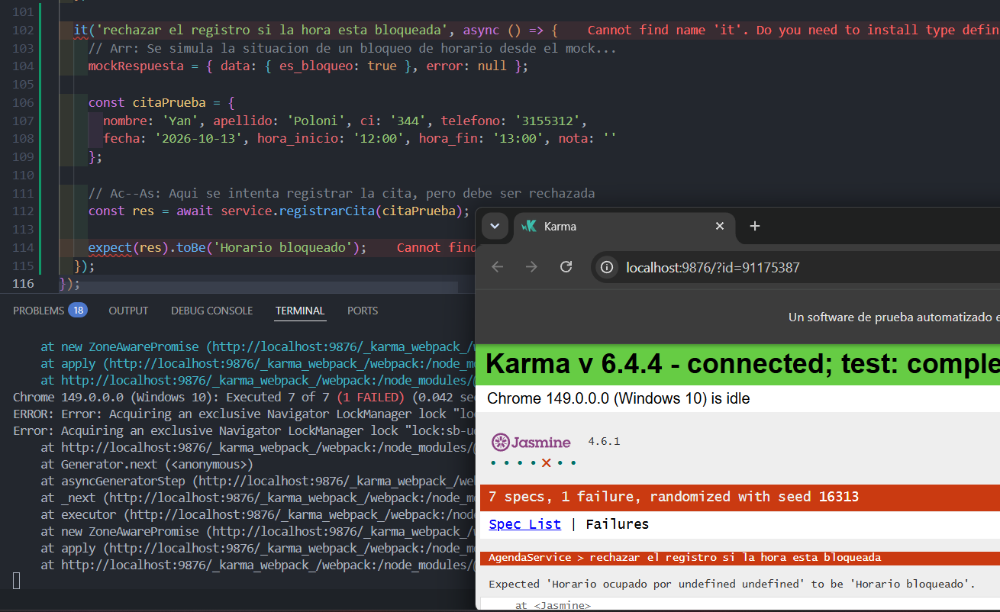

---

**Commit 2 — Verde** [`d73bd0c`](https://github.com/FerSV4/Taller-ConsultorioPsicologia/commit/d73bd0c65917c0f1c82e953af53586a62a6df364):
```
feat: [HU-07] habilita valid. del bloqueo de registro de citas.
```
Código mínimo para hacer pasar el test:
```csharp / typescript
async registrarCita(nuevaCita: Cita): Promise<string | null> {
    const { data: conflicto, error: errorBusqueda } = await this.supabase
      .from('citas')
      .select('nombre, apellido, hora_inicio, hora_fin, es_bloqueo')
      .eq('fecha', nuevaCita.fecha)
      .lt('hora_inicio', nuevaCita.hora_fin)
      .gt('hora_fin', nuevaCita.hora_inicio)
      .limit(1)
      .maybeSingle();

    if (errorBusqueda) return 'Error en el servidor';
    if (conflicto) {
      if (conflicto.es_bloqueo) {
        return 'Horario bloqueado';
      }
      return `Horario ocupado por ${conflicto.nombre} ${conflicto.apellido}`;
    }
```

> Captura del test pasando:

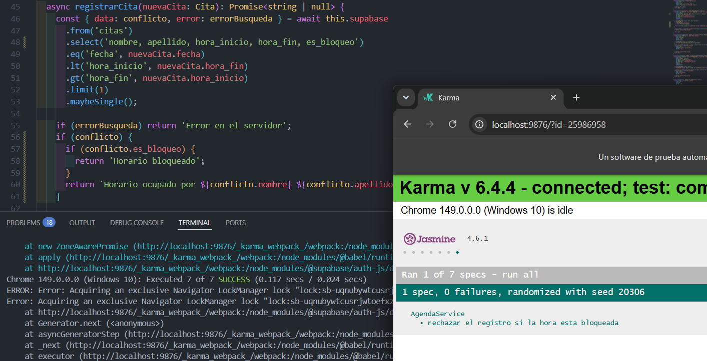

---

**Commit 3 — Refactor** [`b29ec6f`](https://github.com/FerSV4/Taller-ConsultorioPsicologia/commit/b29ec6f728d23e4e53b84a86c8ef4a51c3bac7e5):
```
refactor: [HU-07] simplificar funcion, quitar datos innecesarios de supa.
```
Cambios aplicados:
```csharp / typescript
  async registrarCita(nuevaCita: Cita): Promise<string | null> {
    //El refactor es quitar del select los campos que no se usan como es hora inicio y hora fin.
    const { data: conflicto, error: errorBusqueda } = await this.supabase
      .from('citas')
      .select('nombre, apellido, es_bloqueo')
      .eq('fecha', nuevaCita.fecha)
      .lt('hora_inicio', nuevaCita.hora_fin)
      .gt('hora_fin', nuevaCita.hora_inicio)
```

> Captura del test aún pasando después del refactor:

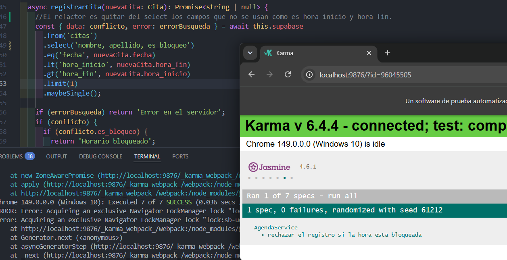

---

### Cobertura final

**Cobertura alcanzada:** 57.5%

> Captura del reporte de cobertura final:

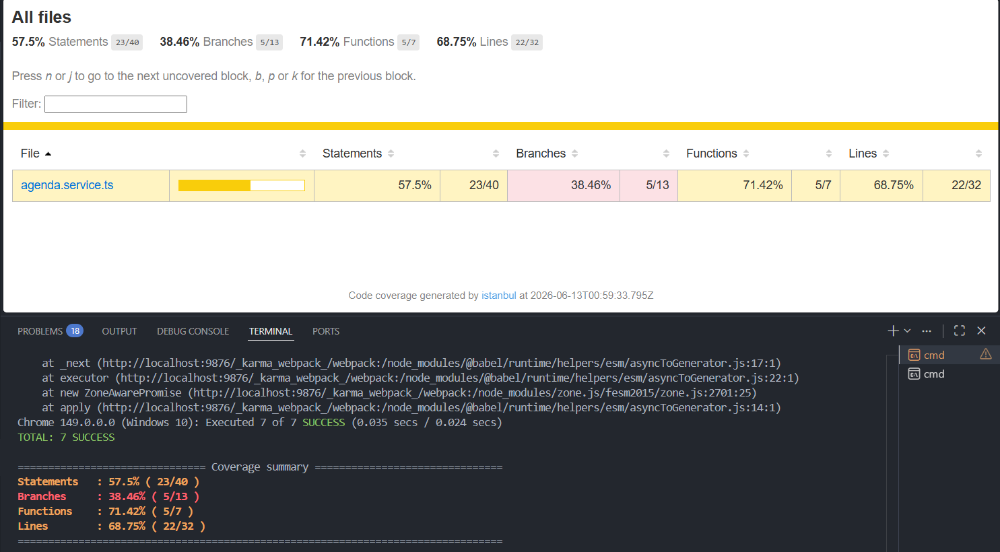

> Si la cobertura es <50%, pegar aquí la justificación enviada al docente:

---

## Sección 3 — Code smells corregidos

Mínimo 3 nuevos (adicionales a los del EC2).

| # | Tipo | Commit | Descripción |
|---|---|---|---|
| 1 | [Unused Variables] | [`64b1121`](https://github.com/FerSV4/Taller-ConsultorioPsicologia/commit/64b11217ec042dbf5c48b6687f20f2860f9ecd7e) | [Antes se declaraba variables para los errores del catch, como no eran utilizados, consume recurso entonces se limpio la variable.] |
| 2 | [Constructor Injection] | [`e65e601`](https://github.com/FerSV4/Taller-ConsultorioPsicologia/commit/e65e6017bf3e89a0ef985b6a3b06ce157dc9ebc3) | [Antes se inyectaban los constructores de la forma antigua de constructor(), ahora se usa el inject moderno de angular.] |
| 3 | [Duplicated Code] | [`920ff2d`](https://github.com/FerSV4/Taller-ConsultorioPsicologia/commit/920ff2da676003febee7f31f920442a7c18e6267) | [Antes la logica de verificacion de horarios estaba repetida en el codigo, ahora se unifico en una funcion verificarConflictoHorario que lo simplifica.] |

### Detalle — Smell 1: [Unused Variables]

**Código antes:**
```csharp / typescript
} catch (e) { 
      this.error = 'Error del sevidor.';
    } finally {
      this.cargando = false;
```

**Código después:**
```csharp / typescript
 alert('Cita registrada.');
        this.router.navigate(['/calendario']);
      }
    } catch { 
      this.error = 'Error del sevidor.';
    } finally {
      this.cargando = false;
```

---

### Detalle — Smell 2: [Constructor Injection]

**Código antes:**
```csharp / typescript
import { Component, OnInit } from '@angular/core';
import { Component, OnInit } from '@angular/core';
import { UpperCasePipe } from '@angular/common';
import { AgendaService, Cita } from '../../servicios/agenda.service';

  citas: Cita[] = [];
  cargando = true;

  constructor(private agendaService: AgendaService) {}
```

**Código después:**
```csharp / typescript
import { Component, OnInit, inject } from '@angular/core';
import { UpperCasePipe } from '@angular/common';
import { AgendaService, Cita } from '../../servicios/agenda.service';

export class DatosComponent implements OnInit {
  citas: Cita[] = [];
  cargando = true;

  private agendaService = inject(AgendaService);
  constructor() {}
```

---

### Detalle — Smell 3: [Duplicated Code]

**Código antes:**
```csharp / typescript
 async registrarCita(nuevaCita: Cita): Promise<string | null> {
    //El refactor es quitar del select los campos que no se usan como es hora inicio y hora fin.
    const { data: conflicto, error: errorBusqueda } = await this.supabase
      .from('citas')
      .select('nombre, apellido, es_bloqueo')
      .eq('fecha', nuevaCita.fecha)
      .lt('hora_inicio', nuevaCita.hora_fin)
      .gt('hora_fin', nuevaCita.hora_inicio)
      .limit(1)
      .maybeSingle();


        async actualizarCita(id: number, citaEditada: Partial<Cita>): Promise<string | null> {
    const { data: conflicto, error: errorBusqueda } = await this.supabase
      .from('citas')
      .select('nombre, apellido')
      .eq('fecha', citaEditada.fecha)
      .lt('hora_inicio', citaEditada.hora_fin)
      .gt('hora_fin', citaEditada.hora_inicio)
      .neq('id', id)
      .limit(1)
      .maybeSingle();
```

**Código después:**
```csharp / typescript
//Code smell de DRY en esta parte.
  private async verificarConflictoHorario(fecha: string, horaInicio: string, horaFin: string, idExcluido?: number) {
    let query = this.supabase
      .from('citas')
      .select('nombre, apellido, es_bloqueo')
      .eq('fecha', fecha)
      .lt('hora_inicio', horaFin)
      .gt('hora_fin', horaInicio);

    if (idExcluido) {
      query = query.neq('id', idExcluido);
    }

    return await query.limit(1).maybeSingle();
  }

  async registrarCita(nuevaCita: Cita): Promise<string | null> {
   const { data: conflicto, error: errorBusqueda } = await this.verificarConflictoHorario(
      nuevaCita.fecha, nuevaCita.hora_inicio, nuevaCita.hora_fin
    );

  async actualizarCita(id: number, citaEditada: Partial<Cita>): Promise<string | null> {
     const { data: conflicto, error: errorBusqueda } = await this.verificarConflictoHorario(
      citaEditada.fecha!, citaEditada.hora_inicio!, citaEditada.hora_fin!, id
    );
```

---

## Sección 4 — Trazabilidad HU → CA → test

| # | Historia de Usuario | Criterio de Aceptación | Prueba que valida ese CA | Commit |
|---|---|---|---|---|
| 1 | [HU-03 Reprogramacion y eliminacion de citas] | [El sistema valida que el horario no se superponga con otras citas (excluyendose a si misma...)] | [rechazar reprogramacion si choca con otra cita] | [`227c026`](https://github.com/FerSV4/Taller-ConsultorioPsicologia/commit/227c0260cae584c7012ef64cc452c1dc050efafd#diff-37bcad398340204cd9cfc8354312e0e1d7dedd0cec3a1f5d385251436c03b29b) |
| 2 | [HU-04 Control de asistencia] | [El sistema no debe permitir cambiar el estado de la cita cuando si el estado actual es 'cancelado'.] | [impedir cambio de estado cuando la cita ya fue cancelada] | [`168bc90`](https://github.com/FerSV4/Taller-ConsultorioPsicologia/commit/168bc902a7bdfa440e75262938ff926820b32187#diff-37bcad398340204cd9cfc8354312e0e1d7dedd0cec3a1f5d385251436c03b29b) |
| 3 | [HU-07 Bloqueo de horarios] | [Al intentar agendar una cita en un horario que esta marcado como bloqueado, el sistema debe mostrar un mensaje de horario bloqueado.] | [rechazar el registro si la hora esta bloqueada] | [`7580e88`](https://github.com/FerSV4/Taller-ConsultorioPsicologia/commit/7580e887faafab535c2e96cb22e1c1a2ac091454) |

### Cadena 1 — [HU-03 Reprogramacion y eliminacion de citas]

**Historia de Usuario:**
> Como recepcionista quiero modificar los datos de una cita existente, y el sistema debe validar las fechas para que no se superponga con otra ya definida.

**Criterio de Aceptación elegido:**
> El sistema valida que el horario no se superponga con otras citas (excluyendose a si misma...)

**Prueba que valida este CA:**
```csharp / typescript
it('rechazar reprogramacion si choca con otra cita', async () => {
    // Arr: Simulo una cita existente a nombre de yan pol
    mockRespuesta = { data: { nombre: 'Yan', apellido: 'Pol' }, error: null };

    const citaEditada = {
      fecha: '2026-11-15', hora_inicio: '09:00', hora_fin: '10:00'
    };

    // Ac--As: Se hace el intento de actualizacion, ser fallido
    const res = await service.actualizarCita(5, citaEditada);
    
    expect(res).toBe('Horario ocupado por Yan Pol');
  });
```

---

### Cadena 2 — [HU-04 Control de asistencia]

**Historia de Usuario:**
> Como especialista(psicologo) quiero marcar el estado de asistencia de una cita, pero el sistema debe bloquearlo ya que la cita fue cancelada.

**Criterio de Aceptación elegido:**
> El sistema no debe permitir cambiar el estado de la cita cuando si el estado actual es 'cancelado'.

**Prueba que valida este CA:**
```csharp / typescript
it('impedir cambio de estado cuando la cita ya fue cancelada', async () => {
    // Arrg: Se crea una cita cancelada como simulacion para esta prueba...
    mockRespuesta = { data: { estado: 'Cancelado' }, error: null };

    // Ac--As: Aqui se intenta marcarla como asistida, tiene q dar error...
    const res = await service.actualizarEstadoCita(10, 'Asistió');
    
    expect(res).toBe('No se puede modificar una cita cancelada');
  });
```

---

### Cadena 3 — [HU-07 Bloqueo de horarios]

**Historia de Usuario:**
> Como especialista(psicologo) quiero marcar horarios especifico como bloqueados para evitar que se programen citas en esos tiempos.

**Criterio de Aceptación elegido:**
> Al intentar agendar una cita en un horario que esta marcado como bloqueado, el sistema debe mostrar un mensaje de horario bloqueado.

**Prueba que valida este CA:**
```csharp / typescript
it('rechazar el registro si la hora esta bloqueada', async () => {
    // Arr: Se simula la situacion de un bloqueo de horario desde el mock...
    mockRespuesta = { data: { es_bloqueo: true }, error: null };

    const citaPrueba = {
      nombre: 'Yan', apellido: 'Poloni', ci: '344', telefono: '3155312',
      fecha: '2026-10-13', hora_inicio: '12:00', hora_fin: '13:00', nota: ''
    };

    // Ac--As: Aqui se intenta registrar la cita, pero debe ser rechazada
    const res = await service.registrarCita(citaPrueba);
    
    expect(res).toBe('Horario bloqueado');
  });
```
